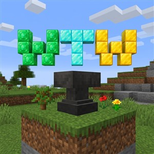
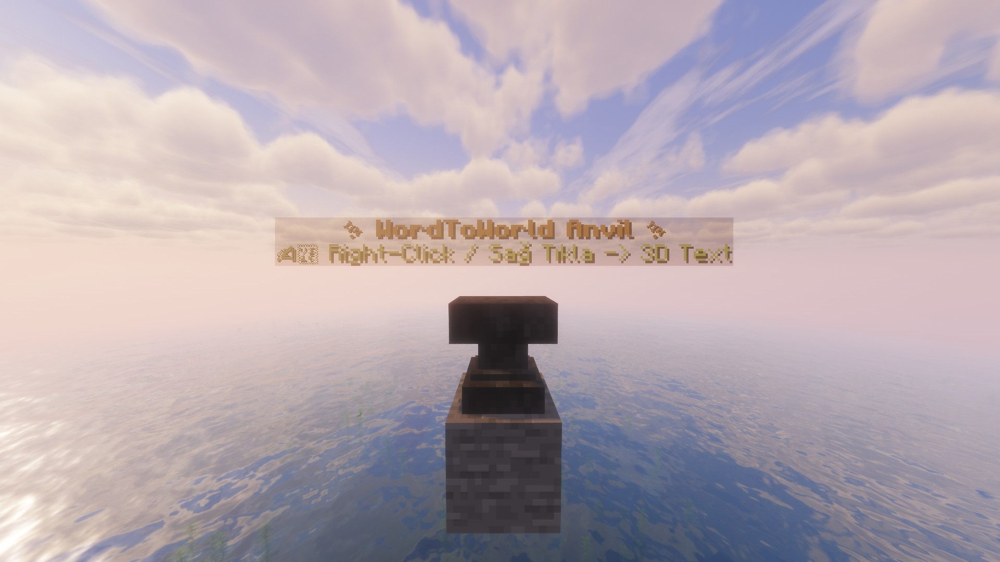
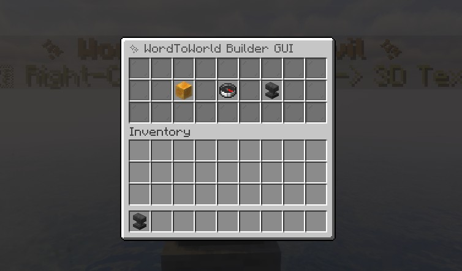
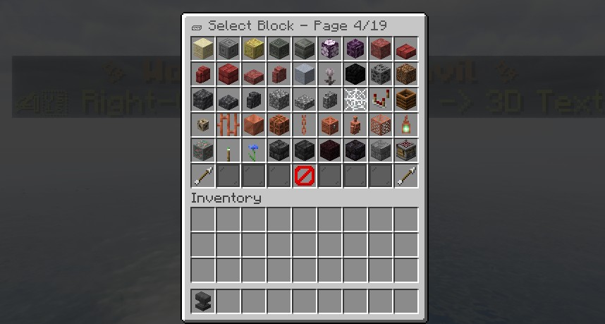
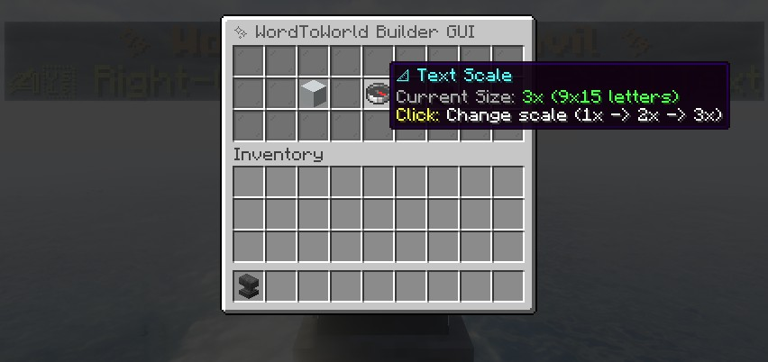
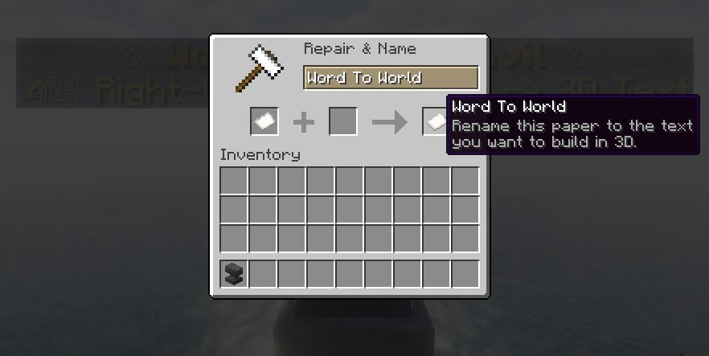
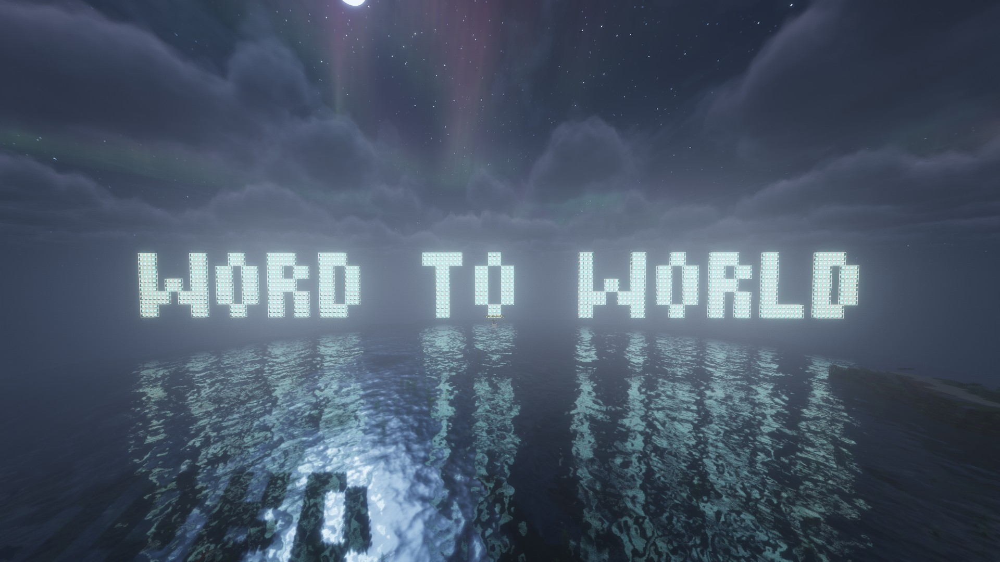

# ✨ WordToWorld v1.0.0

  

Turn your words into **3D Block Structures** in Minecraft using custom Anvils!  
*Özel Örsler kullanarak kelimelerinizi dünyada 3D Blok Yapılara dönüştürün!*

---

## 🌟 English Overview

**WordToWorld** is a high-performance, modular Paper/Spigot plugin created by **kayapater**. It allows players and server admins to place custom anvils, right-click to open an interactive **Builder GUI**, select block materials & text dimensions (**1x, 2x, 3x**), and type text to instantly build stunning 3D block typography in their world!

### 🚀 Key Features

- ✍️ **Instant 3D Text Building**: Build proportional 3D text in world right in front of your anvil.
- 🧱 **54+ Selectable Solid Blocks**: Concretes, Terracottas, Ores, Wood, Glass, Obsidian, Glowstone, etc.
- 📐 **Dynamic Scaling System**:
  - **1x (Small - 3x5)**: Compact 3D lettering.
  - **2x (Medium - 6x10)**: Double-thickness bold text.
  - **3x (Giant - 9x15)**: Monumental 3D structures.
- 🌐 **Automatic Client Multi-Language (i18n)**:
  - Supports **English**, **Turkish**, **Spanish**, **German**, **French**, **Russian**, **Chinese**, and **Japanese** based on player's client language.
- ✨ **Floating Hologram Display**: 3D floating hologram indicator above placed custom anvils.
- 🛡️ **Admin & Permission Control**: Obtainable via `/wtw give` command (requires `wordtoworld.use` permission or OP).
- 🔏 **Digitally Signed & Obfuscated**: Signed with `kayapater` 2048-bit RSA certificate.

---

## 🇹🇷 Türkçe Açıklama

**WordToWorld**, **kayapater** tarafından geliştirilen yüksek performanslı Paper/Spigot eklentisidir. Özel örsler aracılığıyla oyuncuların ve sunucu yetkililerinin kolayca 3D blok metinler inşa etmesini sağlar. 

Örse sağ tıklandığında açılan menüden **blok türü** ve **yazı boyutu (1x, 2x, 3x)** seçilip, örs penceresine kelime yazılarak 3D metin inşası otomatik başlatılır.

---

## 📸 Screenshots / Ekran Görüntüleri

---

## 🛠️ Commands & Permissions / Komutlar ve Yetkiler

| Command / Komut | Permission / Yetki | Description / Açıklama |
| :--- | :--- | :--- |
| `/wtw give` | `wordtoworld.use` | Receive a special WordToWorld Anvil item |
| `/wtw info` | `wordtoworld.use` | Show plugin & developer information |
| `/wtw help` | `wordtoworld.use` | Display the command help menu |

---

## 📥 Installation Guide / Kurulum Rehberi

1. Download [`WordToWorld-1.0.0.jar`](WordToWorld-1.0.0.jar).
2. Drop the `.jar` file into your server's `plugins/` directory.
3. Start or reload your Paper / Spigot server (1.20.4+ / 1.21+ / 26.2+).
4. Run `/wtw give` to receive the special WordToWorld Anvil!

---

## 📜 License / Lisans

Copyright © 2026 **kayapater**. All Rights Reserved.  
*Tüm Hakları Saklıdır. Geliştirici: kayapater.*
